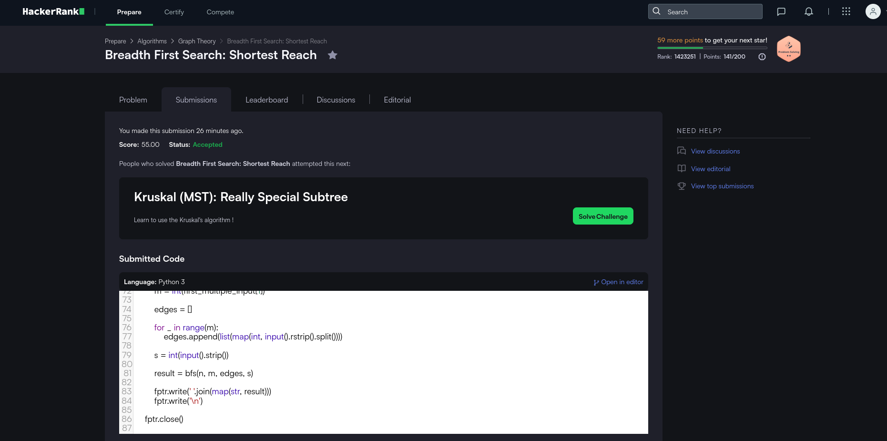
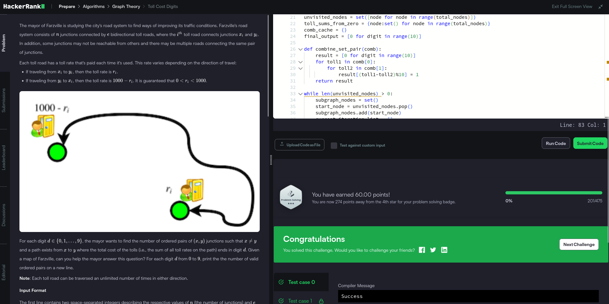
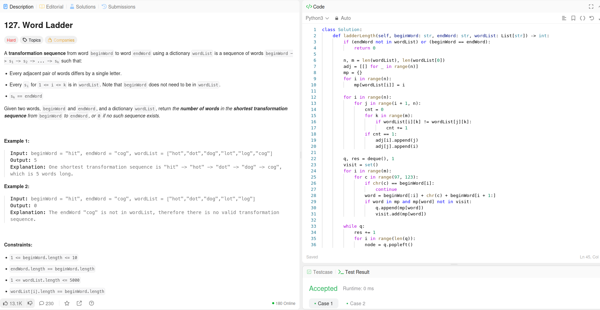

# Grafos1-Dupla-55

Temas:
 - Grafos1

**Número da Lista**: 1<br>
**Conteúdo da Disciplina**: Grafos 1<br>

## Alunos
|Matrícula | Aluno |
| -- | -- |
| 21/1031520 |  Victor Hugo da Cunha Santos |
| 23/1037665 |  Daniel Rodrigues Nascimento |

## Sobre 
Resolução de exercícios do CodeForces/LeetCode/AtCoder/HackerRank de acordo com as condições
propostas pelo professor em sala de aula.


## Exercícios
|Exercício | Resolução | Dificuldade |
| -- | -- | -- |
| [BFSShortestReach](https://www.hackerrank.com/challenges/bfsshortreach/problem) | [BFSShortestReach.py](https://github.com/projeto-de-algoritmos-2025/Grafos1-D55/tree/main/BFSShortestReach.py) | Média |
| [TollCostDigits](https://www.hackerrank.com/challenges/toll-cost-digits/problem) | [TollCostDigits.py](https://github.com/projeto-de-algoritmos-2025/Grafos1-D55/tree/main/TollCostDigits.py) | Difícil |
| [WordLadder](https://leetcode.com/problems/word-ladder/) | [WordLadder.py](https://github.com/projeto-de-algoritmos-2025/Grafos1-D55/tree/main/WordLadder.py) | Difícil |

## Screenshots
- *BFSShortestReach*
<div align="center">
	
</div>

- *TollCostDigits*
<div align="center">
	
</div>

- *WordLadder*
<div align="center">
	
</div>


## Instalação 
**Linguagem**: <br>
- Python

## Uso 
- Ter o Python 3 instalado na máquina
- Para rodar a resolução do exercício BFSShortestReach:

```bash
python nome_do_arquivo.py
```

## Outros 
Quaisquer outras informações sobre seu projeto podem ser descritas abaixo.
